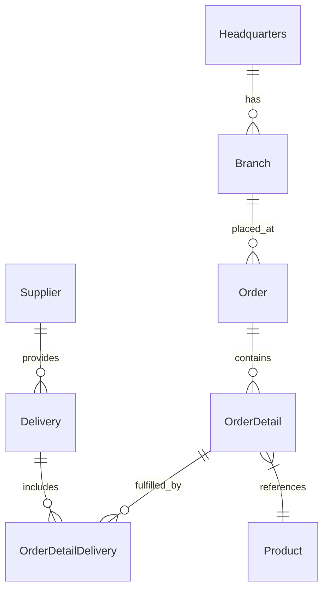
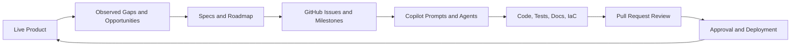
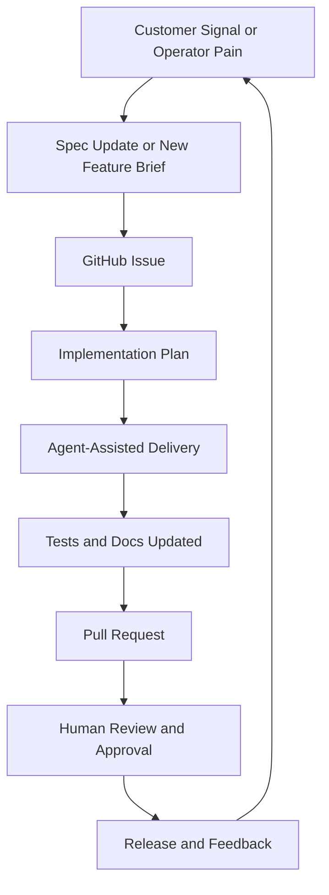

# OctoCAT Supply


## Executive Summary

This repository is the working artifact behind a product management talk for a Fortune 500 audience on how to use AI, GitHub Copilot, and agentic workflows to evolve a real product inside the GitHub ecosystem without losing control of quality, governance, or traceability.

Watch the talk: [YouTube presentation](https://www.youtube.com/watch?v=TOAAKp9NYDw)

Reference repository: [customize-your-repo-with-github-copilot](https://github.com/microsoftnorman/customize-your-repo-with-github-copilot)

The point of the talk is not that AI can generate code. The point is that AI can participate in a governed product operating system:

- A live product gives the agents real context.
- Specs, prompts, and custom instructions constrain the work.
- GitHub issues and pull requests create traceability.
- Human review remains the approval boundary.
- Documentation, architecture, and deployment assets stay in the same system of record.

This repo demonstrates those practices end to end using a TypeScript monorepo for a B2B supply chain demo application called OctoCAT Supply.

## What This Proves

This repository is designed to answer a board-level question: "Can an organization use agentic development in a way that is auditable, compliant, and operationally credible?"

The answer presented here is yes, if the workflow is structured correctly.

The controls demonstrated in this repo are practical rather than theoretical:

- Product context lives in version control through docs, specs, and architecture artifacts.
- Agent behavior is bounded through repository instructions, scoped instruction files, and custom agents.
- Implementation work can be driven from issues, prompts, designs, and acceptance criteria.
- Changes remain reviewable through diffs, pull requests, and code ownership.
- Deployment intent is captured as infrastructure as code with documented environment assumptions.
- Residual gaps are called out explicitly rather than hidden.

## The Product

OctoCAT Supply is a B2B supply chain management demo application with two workspaces:

- `api/`: Express 4 REST API in TypeScript with in-memory seed data and Swagger/OpenAPI.
- `frontend/`: React 18 SPA with Vite, Tailwind CSS, React Query, React Router, and Context-based auth/theme state.

The domain model covers headquarters, branches, orders, products, suppliers, deliveries, and order fulfillment relationships.



## The Operating Model

The talk is built around a simple claim: agentic product development is trustworthy only when product management, engineering, and governance are operating in the same loop.



In practice, that means:

- Product managers define intent in docs, specs, issues, and acceptance criteria.
- Agentic users accelerate analysis, scaffolding, implementation, test generation, and documentation updates.
- Engineers review outputs, tighten assumptions, and own the final merge decision.
- Governance teams inspect the same artifacts the builders use instead of relying on a parallel reporting stream.

## Why GitHub Is The Right Control Plane

This repository uses GitHub as the coordination layer for product, engineering, and compliance work.

```mermaid
flowchart TD
    subgraph Governance
        A1[Copilot Instructions]
        A2[Scoped Instruction Files]
        A3[Custom Agents]
        A4[CODEOWNERS]
    end

    subgraph Product System
        B1[README and Architecture]
        B2[Feature Specs]
        B3[Customer POV Research]
        B4[Roadmap Inputs]
    end

    subgraph Delivery System
        C1[API and Frontend Code]
        C2[Tests]
        C3[Docs]
        C4[Infra as Code]
    end

    subgraph Review System
        D1[Issues]
        D2[Pull Requests]
        D3[Human Approval]
    end

    Governance --> Product System
    Product System --> Delivery System
    Delivery System --> Review System
    Review System --> Governance
```

The important point is not tool sprawl. It is consolidation. Product intent, agent instructions, implementation artifacts, and approval decisions all sit in one audit trail.

## What Exists In This Repository Today

This repo contains the elements required to show a credible agentic product workflow:

| Area | Evidence in repo | Why it matters |
| --- | --- | --- |
| Product narrative | `README.md`, `docs/full-spec.md`, `docs/specs/` | Captures scope, business intent, and expected behavior |
| Architecture | `docs/architecture.md` | Makes the system shape inspectable before implementation changes |
| Agent governance | `.github/copilot-instructions.md`, `.github/instructions/` | Constrains how Copilot behaves in this codebase |
| Specialized agents | `.github/agents/` | Demonstrates persona- or task-specific agent workflows |
| Product research | `docs/customer-pov/` | Shows customer and stakeholder feedback as first-class artifacts |
| Working software | `api/`, `frontend/` | Grounds the exercise in a live product rather than a slide deck |
| Deployment intent | `infra/`, `azure.yaml`, `docs/deployment.md` | Connects product work to operational reality |
| Quality signal | `api` tests, lint/build scripts | Shows that generated work is expected to compile and be reviewed |

## Compliant Agentic Product Management

The safest way to use AI in product and engineering is to define where autonomy stops.

This repo supports a compliant operating posture with these principles:

- AI can propose, draft, scaffold, summarize, and implement.
- AI should not silently redefine scope, acceptance criteria, or production approvals.
- Every meaningful change should map to a documented requirement or issue.
- Pull requests are the formal review boundary.
- Human reviewers own the merge decision.
- Known gaps are documented as risks, not buried as assumptions.

### Control Boundaries

| Activity | Agent can assist | Human must approve |
| --- | --- | --- |
| Problem framing | Summaries, gap analysis, draft specs | Final prioritization and success criteria |
| Roadmap shaping | Milestone proposals, issue drafts, dependency mapping | Portfolio sequencing and tradeoff decisions |
| Implementation | Code changes, tests, docs, refactors | Final review, architectural exceptions, release signoff |
| Compliance support | Audit-friendly documentation, rationale capture, traceability | Policy interpretation and risk acceptance |
| Deployment | Workflow generation, IaC drafting, environment docs | Secret management, approvals, production release |

## Example Talk Track

The product talk can be run as a live progression instead of a static presentation.

1. Start with the live product and explain the current user experience.
2. Show the specs, architecture, and customer POV documents that define product intent.
3. Demonstrate how custom instructions and agents narrow the solution space.
4. Use prompt-driven analysis to identify roadmap opportunities.
5. Move from roadmap item to implementation plan inside GitHub.
6. Generate or refine code, tests, and docs under review.
7. Close by showing the explicit control points and residual risks.

## Sample Prompts For Safe AI SDLC

This section teaches how to use the custom agents and prompts in this repository to run a governed software development lifecycle with AI. Each phase of the SDLC maps to specific agents, and the prompts below show exactly how to invoke them.

The key principle: **different agents own different phases**. A product manager agent should never silently write production code. A test writer agent should never silently change scope. Each agent is constrained to its role, and human review gates sit between phases.

### How Agents Are Invoked

In VS Code Copilot Chat, switch to an agent using the mode picker or `@agent-name` syntax. Each agent listed below corresponds to a file in `.github/agents/`.

---

### Phase 1: Discovery and Research

**Goal:** Understand the current product, market, and user needs before proposing changes.

#### @product-manager — Strategic product analysis

```text
Review the OctoCAT Supply product against the specs in docs/specs/ and the customer feedback
in docs/customer-pov/. Identify the three highest-value gaps for our next quarter. For each
gap, include the user problem, supporting evidence from the repo, competitive risk, and a
measurable success outcome.
```

#### @market-researcher — Competitive intelligence

```text
Research how Amazon Business, Chewy for Business, and PetSmart handle bulk ordering and
reorder workflows for B2B customers. Return a structured comparison with feature gaps
relevant to OctoCAT Supply.
```

#### @codebase-analyst — Technical inventory

```text
Produce a full inventory of the API routes, models, and frontend pages. For each route,
report whether it has test coverage, Swagger documentation, and seed data. Flag any routes
missing tests.
```

---

### Phase 2: Stakeholder Feedback (Persona Agents)

**Goal:** Pressure-test ideas against real user perspectives before committing to implementation. These persona agents respond **in character** with authentic priorities and concerns.

#### @marcus-chen-warehouse-manager — Operations reality check

```text
I'm considering adding a barcode scanning feature to the order fulfillment flow.
Walk me through how your warehouse team would actually use this during a morning
rush. What would make it useful versus another feature that looks good in demos
but slows your people down?
```

#### @sarah-mitchell-operations-director — Executive lens

```text
We're proposing a new analytics dashboard for branch performance comparison.
Review the current product and tell me what KPIs you'd actually need on day one,
what would be noise, and what's missing that would make you bring this to a
board meeting.
```

#### @priya-sharma-branch-manager — Branch-level operations

```text
Look at the current order management workflow. Tell me what frustrates you about
it when you're trying to hit your monthly targets, and what one change would save
your team the most time per week.
```

#### @david-okafor-procurement-officer — Procurement and compliance

```text
Review the supplier management features in the app. Tell me what's missing for
you to actually trust this system for managing vendor contracts, tracking delivery
reliability, and running a quarterly supplier scorecard.
```

#### @jake-rodriguez-store-associate — Frontline usability

```text
Use the product catalog and order pages. Tell me what's slow, what's confusing,
and what you'd change if you had to use this system for 8 hours a day on a tablet
at the counter.
```

---

### Phase 3: Specification and Planning

**Goal:** Turn validated ideas into scoped, implementable work items with clear acceptance criteria.

#### @product-manager — Feature specification

```text
Create a complete feature spec for a bulk reorder workflow. Include the user problem,
target personas, proposed UX flow, API changes, data model impact, acceptance criteria,
risks, and a breakdown into GitHub issues sized for individual pull requests. Follow the
format used in docs/specs/.
```

#### @product-manager — Issue creation from spec

```text
Read docs/specs/logistics.md and create GitHub issues for every unimplemented feature
described in the spec. Each issue should include acceptance criteria, affected files,
and a testing expectation. Use the create-github-issue skill.
```

#### @backlog-analyst — Backlog health check

```text
Scan all open GitHub issues. Cross-reference them against the specs in docs/specs/
and the current codebase. Report which issues have specs, which are duplicates, which
are stale, and which are missing acceptance criteria.
```

---

### Phase 4: Implementation

**Goal:** Generate code changes that are bounded by the repository's instructions, tested, and documented.

#### Default agent (or @copilotrepo for repo setup) — Constrained implementation

```text
Implement the supplier rating feature described in issue #42. Follow the repository
instructions in .github/instructions/API.instructions.md. Add the route, model, seed
data, and Swagger docs. Do not modify existing routes. Call out any assumptions that
need human review before merge.
```

#### @implementation-ideas — Explore multiple approaches

```text
Explore three different approaches for adding real-time delivery tracking to the
order detail page. For each approach, show the tradeoffs in complexity, testability,
and user experience. Then implement the best one as a pull request.
```

---

### Phase 5: Testing and Quality

**Goal:** Prove that the implementation works and doesn't break existing behavior. This is Martin's domain.

#### @martin — Audit existing test coverage

```text
Audit the API test coverage. For every route file in api/src/routes/, report whether
a test file exists, what behaviors are covered, and what gaps remain. Prioritize the
gaps by defect risk and propose the exact tests to add.
```

#### @martin — Write missing tests

```text
Write route integration tests for the product, supplier, and order routes. Follow the
branch.test.ts pattern. Cover CRUD operations, 404 handling, and any edge cases you
find in the route code. Add reset functions to the route files if they're missing.
Fix any defects you find along the way.
```

#### @martin — Regression coverage for a bug fix

```text
I just fixed a bug where updating an order with a non-existent ID returned 500
instead of 404. Write a regression test that proves the fix works, and check whether
the same bug pattern exists in other routes.
```

#### Reusable prompt — Unit-Test-Coverage

> Use the prompt file `.github/prompts/Unit-Test-Coverage.prompt.md` to run a guided test coverage session for specific routes.

---

### Phase 6: Documentation and Review

**Goal:** Keep docs in sync with the code, and prepare changes for human review.

#### Reusable prompt — Documentation Update

> Use `.github/prompts/documentation-update.prompt.md` to automatically update README, architecture, build, and deployment docs to match the current codebase.

#### @product-manager — Review-board risk summary

```text
Assess the changes in this pull request for blind spots. Analyze security, testing,
data integrity, accessibility, operational readiness, documentation completeness, and
rollback considerations. Distinguish between verified facts and assumptions that still
need validation.
```

#### Default agent — Auditor perspective

```text
Review this repository for process integrity. Identify where product intent is
documented, where agent behavior is constrained, where approvals should occur,
and which areas still represent delivery risk or governance gaps.
```

---

### Phase 7: Commit, PR, and Deployment

**Goal:** Package work into reviewable, traceable units with conventional commits and comprehensive PRs.

#### Skill: commit-and-push

```text
Run all tests, then commit and push my changes with a conventional commit message
tied to the related issue.
```

#### Skill: create-pull-request

```text
Create a pull request for this branch. Include a summary of what changed, why it
changed, which issues it closes, what was tested, and what a reviewer should pay
attention to.
```

---

### Phase 8: Continuous Improvement

**Goal:** Use persona agents to evaluate shipped features and feed findings back into the next cycle.

#### @sarah-mitchell-operations-director — Post-ship evaluation

```text
The analytics dashboard shipped last week. Review it as if you're preparing for
your quarterly ops review. What works, what's missing, and what would you escalate
to the product team?
```

#### @marcus-chen-warehouse-manager — Usability regression

```text
Walk through the delivery management workflow as someone who does this 50 times
a day. Tell me if anything got worse, slower, or more confusing since the last
update.
```

#### @copilotrepo — Improve agent governance

```text
Audit the current .github/ customization files. Are the instructions still accurate?
Are any agents missing constraints? Are there new patterns in the codebase that should
be captured in instructions? Propose updates.
```

---

### SDLC Phase Map

| SDLC Phase | Primary Agent | Supporting Agents | Human Gate |
| --- | --- | --- | --- |
| Discovery | @product-manager | @market-researcher, @codebase-analyst | Prioritization approval |
| Stakeholder feedback | Persona agents (Marcus, Sarah, Priya, David, Jake) | Shopper personas | Feedback triage |
| Specification | @product-manager | @backlog-analyst | Spec sign-off |
| Implementation | Default agent | @implementation-ideas | Code review |
| Testing | @martin | — | Test review + merge |
| Documentation | Default agent | @product-manager | Doc review |
| Commit and PR | Skills (commit-and-push, create-pull-request) | — | PR approval |
| Continuous improvement | Persona agents | @copilotrepo | Roadmap update |

### What This Proves About Safe AI SDLC

1. **Separation of concerns.** Each agent has a bounded role. The product manager doesn't write code. The test writer doesn't change scope. Personas don't approve their own feedback.
2. **Human review gates.** Every phase ends at a decision point that requires a human. AI proposes; humans approve.
3. **Traceability.** Specs map to issues. Issues map to PRs. PRs map to tests. The entire chain is auditable in GitHub.
4. **Constraint enforcement.** Repository instructions, scoped instruction files, and agent definitions prevent agents from drifting outside their mandate.
5. **Honest gap reporting.** Agents are instructed to call out assumptions, risks, and missing coverage rather than hiding them.
6. **Feedback loops.** Persona agents validate before implementation and evaluate after shipping, closing the learning cycle.

## Example Roadmap Pattern Inside GitHub

This is the roadmap pattern the talk advocates.



A strong roadmap item in this model should always answer:

- What user or operator problem is being solved?
- What evidence supports prioritization?
- What files, APIs, or workflows are expected to change?
- What tests and documents must change with the implementation?
- What could go wrong operationally or from a compliance standpoint?
- Who is the named human approver for merge and release?

## Known Constraints And Honest Gaps

The trustworthiness of an AI-enabled delivery model depends on naming the limits of the current build clearly.

Current constraints in this repo include:

- The API uses in-memory data. This is suitable for demos, not production persistence.
- Authentication is client-side only and not production-grade security.
- API route tests exist only for the `branch` route. The remaining seven route files (`delivery`, `headquarters`, `order`, `orderDetail`, `orderDetailDelivery`, `product`, `supplier`) have no test coverage yet. See the Test Coverage section below for the remediation plan.
- Frontend automated test coverage is limited. No React component or integration tests exist.
- Some deployment guidance is documented in detail, but operational hardening still depends on environment-specific decisions outside the repo.
- As with any agentic workflow, prompt quality and human review discipline materially affect outcomes.

These are not reasons to dismiss the model. They are the exact kinds of gaps a credible review board expects to see surfaced early.

## Test Coverage

### Current State

The repository follows a Martin Fowler style test pyramid. API route-level integration tests using Vitest and Supertest are the primary safety net. The existing test file is:

| Route file | Test file | Status |
| --- | --- | --- |
| `api/src/routes/branch.ts` | `api/src/routes/branch.test.ts` | Covered |
| `api/src/routes/delivery.ts` | — | **Missing** |
| `api/src/routes/headquarters.ts` | — | **Missing** |
| `api/src/routes/order.ts` | — | **Missing** |
| `api/src/routes/orderDetail.ts` | — | **Missing** |
| `api/src/routes/orderDetailDelivery.ts` | — | **Missing** |
| `api/src/routes/product.ts` | — | **Missing** |
| `api/src/routes/supplier.ts` | — | **Missing** |

Frontend components currently have no automated tests.

### Test Generation Plan

Missing API tests will be generated following the established `branch.test.ts` pattern:

1. **Pattern.** Each test file co-locates with its route (`<route>.test.ts`), wires a fresh Express app in `beforeEach`, and resets in-memory seed data via the route's exported `reset*()` function.
2. **Coverage scope.** Every test file will cover CRUD operations (list, get-by-id, create, update, delete where applicable), 404 handling for missing resources, and any route-specific edge cases.
3. **Agent workflow.** The `@martin` agent is configured to audit coverage gaps and generate tests that follow repository conventions. Invoke it with:
   ```text
   Write route integration tests for the product, supplier, and order routes. Follow the
   branch.test.ts pattern. Cover CRUD operations, 404 handling, and any edge cases you
   find in the route code. Add reset functions to the route files if they're missing.
   ```
4. **Execution.** Tests run via `npm run test` (all workspaces) or `npm run test:api` (API only). Vitest is configured in `api/vitest.config.ts`.
5. **Governance.** Generated tests go through the same pull request review process as any other code. The `@martin` agent proposes; a human reviewer approves.

### Frontend Testing Roadmap

Frontend tests will be added incrementally following the test pyramid:

- **Priority 1:** Targeted component tests for high-risk flows (cart, authentication state, order submission).
- **Priority 2:** Feature-level tests for data-fetching behavior using React Query.
- **Priority 3:** A small number of end-to-end tests for critical cross-boundary journeys, added only when lower-level tests cannot credibly cover the risk.

## Running The Repo

### Prerequisites

- Node.js 18 or higher
- npm

### Install

```bash
npm install
```

### Run both workspaces

```bash
npm run dev
```

### Build

```bash
npm run build
```

### Test

```bash
npm run test
npm run lint
```

By default:

- API runs on port `3000`
- Frontend runs on port `5137`

## Repository Structure

```text
api/        Express REST API, models, routes, tests
frontend/   React SPA, components, context, API integration
docs/       Architecture, specs, customer POV, roadmap material
infra/      Bicep deployment assets and deployment configuration
.github/    Copilot instructions, agents, workflow customization
```

## Recommended Demo Flow For Executives Or Review Boards

1. Show the live product.
2. Show the architecture and specs that define the system.
3. Show the repository instructions that constrain agent behavior.
4. Run a prompt that identifies a roadmap gap from the active product.
5. Translate that gap into a scoped implementation plan.
6. Show how the same system can generate code, tests, docs, and deployment updates.
7. End with the honest gap list and approval boundaries.

That sequence changes the conversation from "AI writes code" to "AI participates in a governed product delivery system."

## Supporting Documentation

- [Architecture](./docs/architecture.md)
- [Build Guide](./docs/build.md)
- [Deployment Guide](./docs/deployment.md)
- [Full Specification](./docs/full-spec.md)
- [Feature Specs](./docs/specs/)
- [Customer POV Research](./docs/customer-pov/)

## Acknowledgements

Contributors to the OctoCAT Supply talk and demo experience include Dustin Ellis, Harald Kirschner, and Joel Norman.

This repository is intentionally positioned as a serious working example of product management with AI inside the GitHub ecosystem: ambitious enough to demonstrate leverage, but explicit enough about controls and gaps to earn trust.
